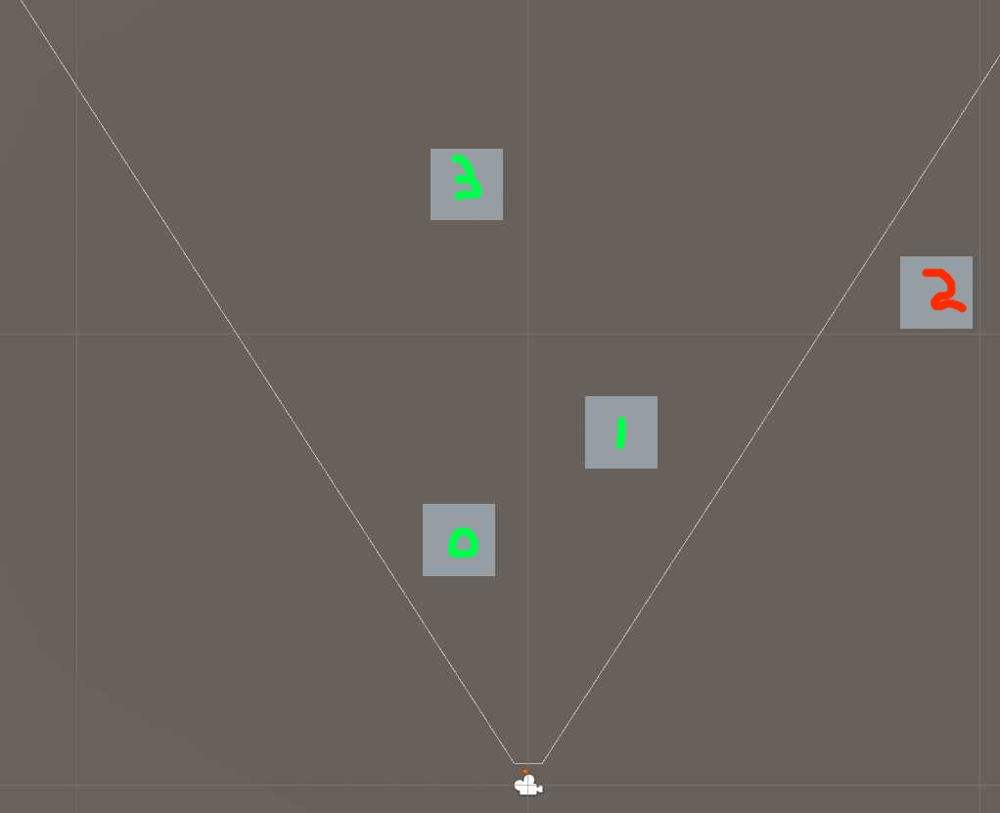

# Rendering in Unity Part 5: GPU Driven Rendering

So far in our series we've gone from zero to roughly understanding the different types of draw options Unity offers us, and how it works under the hood. Although we havent used Unity's helpful utilities, we have never surpassed them. Until today.

## What is GPU driven rendering?

Doesnt our GPU *already* render? It sure does, though we are spending an awful lot of time and resources preparing our data to be exactly how the GPU wants. Modern Graphics API's offer methods that allow us to do more of this heavy lifting on the GPU itself, with them we can offload the preparation of the draw calls to the GPU. 

These APIs are called Indirect Rendering, the Unity equivalent is called [RenderMeshIndirect](https://docs.unity3d.com/ScriptReference/Graphics.RenderMeshIndirect.html). This translates to [DrawIndexedInstancedIndirect](https://learn.microsoft.com/en-us/windows/win32/api/d3d11/nf-d3d11-id3d11devicecontext-drawindexedinstancedindirect) on DirectX 11, or [ExecuteIndirect](https://learn.microsoft.com/en-us/windows/win32/api/d3d12/nf-d3d12-id3d12graphicscommandlist-executeindirect) in DirectX 12.

We're familiar with Vertex and Fragment shaders, but we'll be making [Compute Shaders](https://docs.unity3d.com/Manual/class-ComputeShader.html) soon. They are shaders like we know, but we can choose what and how they compute. This sentence is bad, is it even required?

RenderMeshIndirect wants a GraphicsBuffer from us, within it should be the [IndirectDrawIndexedArgs](https://docs.unity3d.com/ScriptReference/GraphicsBuffer.IndirectDrawIndexedArgs.html) struct. Its members are incredibly similar to what we have already been doing, for example compare the signature to [DrawInstanced](https://learn.microsoft.com/en-us/windows/win32/api/d3d11/nf-d3d11-id3d11devicecontext-drawinstanced). This is an important observation; we are not rendering any differently. The parameters are the exact same, we are just providing it in a way that both the CPU *and* GPU can fill them in.

Those parameters will become very imporant for us soon, so lets make sure we understand them well.

## Indirect Parameters

`baseVertexIndex`, `startIndex` and `indexCountPerInstance` contain information about the mesh. How many triangles are there, where in the mesh that you've given me do they start? These can be queried by getting the Mesh's SubMeshInfo, they map 1:1 to what is inside [SubMeshDescriptor](https://docs.unity3d.com/ScriptReference/Rendering.SubMeshDescriptor.html). 

`startInstance` and `instanceCount` determine the range of the instance-ID we are given in our vertex shader. 

Lets imagine we are rendering our original scene with 10k cubes. We'd make a single entry in our drawindirect, with the base vertex and start index set to 0. Our cube has 36 indices, we can see this in the model inspector, `indexCountPerInstance` should be set to this.
We'd like to render from 0 to 10k, so that will be our `startInstance` and `instanceCount`.

## Doing the thing

Our general strategy will be like this:

1. We'll create a Graphics Buffer for our indirect arguments. We load them up with the data for each (sub)mesh, and leave the `instanceCount` at 0
2. Another Graphics Buffer will contain all PerObjectData. Our culling will use this, but its also where the Vertex shader gets our ObjectToWorlds from.
3. A compute shader takes the PerObjectData as input, as well as the camera parameters. We'll cull them like we did before, and increase the `instanceCount` for each visible object. 

In this scenario, we see that object 0 1 and 3 are visible, while 2 is outside of our frustum. We'd expect our culling shader to have increased the `instanceCount` to 3 elements, however if we were to use the `instanceID` like we have been, directly from [0..2] we'd be drawing the incorrect objects! This is why besides a count, we also need to store visible indices. In this case, the visible indices array would contain [0, 1, 3], in our vertex shader the actual transform to use is: `PerObjectData[VisibleIndices[instanceID]]`. The draw with instanceID 2 will now correctly read from the third object.

4. Create a StructuredBuffer with uints for our visible indices. The culling-compute shader will also emit visible indices.

## Ok but now really doing the thing

We'll first only support having one mesh, so lets disable our spheres. 

<%
TODO WRITE THEM CODES
%>

One thing not mentioned in our approach above is the need to clear. Our compute will add one for each visible object to the instanceCount. If we dont reset this to 0 its bad! What we'll do is have two buffers, one pristine clean state where the instancecount is 0, and one final state. At the beginning of our frame we copy the clean into the dirty, and we're done.  

## Compute Culling

We'll need to port over our existing culling to a compute shader. 

On the CPU side, lets prepare our shader parameters, and fire it off!

<%
[SerializeField] private ComputeShader computeCulling;

void dispatchCull()
{
	int kernelId = computeCulling.FindKernel("CSMain");
	computeCulling.SetVectorArray("Planes", planes);

	computeCulling.Dispatch(kernelId, Math.max(count/64,1), 1, 1);
}
%>

## Multiple meshes

A game with only cubes is hardly a game at all. Lets try to introduce our spheres again.

We could duplicate our current setup, and invoke our culling twice. However, feeding the GPU with larger batches is better. Instead, what we'll do is:

1. Make sure our PerObjectData is sorted by mesh. The first 4 elements are our cubes, the next 6 are our spheres.
2. The first IndirectArgument is for our cube, its `startInstance` will stay 0.
3. Our second IndirectArgument will be for our sphere. We will set the `startInstance` to 4. This effectively means our Vertex shader gets InstanceId from 4 to 10, exactly lining up with our PerObjectData.

TODO: Add image like this: https://d2jaiao3zdxbzm.cloudfront.net/wp-content/uploads/meshlet-buffers-1536x787.png

## Further improvements

- With our depth buffer we can apply occlusion culling. 

- We have to break batches by meshes. We can combine *all* meshes in our scene to a single giant mesh, and use submeshes instead! There is still one indirect arg per submesh, but each RenderIndirect call can be supplied with multiple draw commands. 
- We have to break batches by materials. We can combine *all* materials, that use the same shader. This is the same as [per-instance properties](https://docs.unity3d.com/Manual/gpu-instancing-shader.html).

- Remove completely culled out indirect arguments draws. We can read in the [performance guide](https://gpuopen.com/learn/rdna-performance-guide/#executeindirect) from AMD this is recommended. 