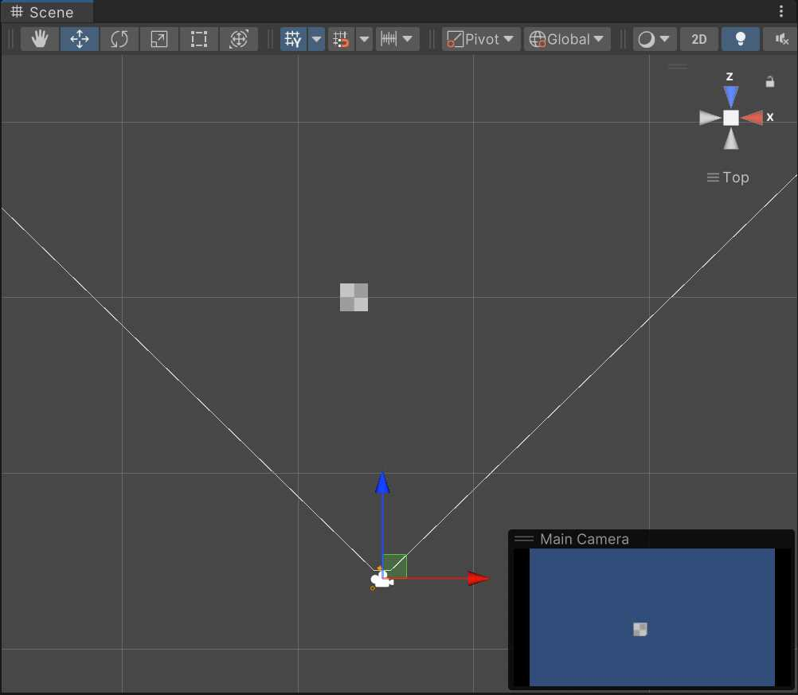
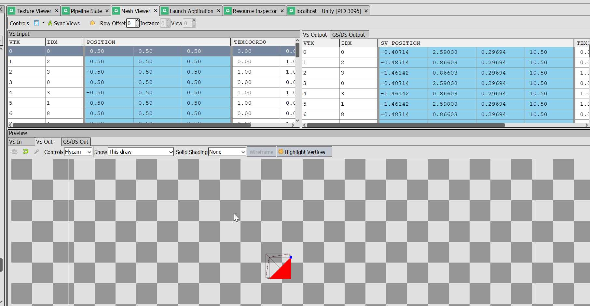
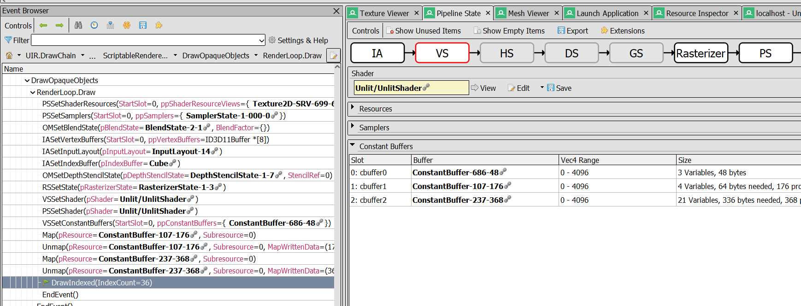

# Rendering in Unity Part 1: Tools of the trade

## What and why
There are [many](https://catlikecoding.com/unity/tutorials/) [great](https://github.com/Xibanya/ShaderTutorials/) [tutorials](https://learn.unity.com/mission/creative-core-shaders-and-materials) around explaining shaders in Unity, focussing mainly on the shading aspect. What pretty colors do we give pixels?
This series will delve deeper into rendering itself; how do we get the GPU to do anything, and how do we convince it to draw pixels at the right location.

## Setup

The project we will be using can be found [here](https://github.com/TJHeuvel/UnityRenderingTutorial/tree/part-one), and uses Unity 2022.2, with the Universal Render Pipeline 14. A lot of features have been disabled for clarity. This includes SRP Batcher, which we will revisit in a later part. We'll use the newer Unity.Mathematics API's, float3 rather than Vector3, because they look more similar to whats going on in our shaders. This tutorial focusses on DirectX 11.

Observe a rather empty scene, with a cube offset to the right, and a camera placed back and and further to the right.

Lets start by learning as much as possible what Unity did for us to render these pretty pixels!

## Frame Debugger
Our first friend is the [Unity Frame Debugger](https://docs.unity3d.com/2022.2/Documentation/Manual/FrameDebugger.html). This is a great tool to get a very high level view of what and how your scene is rendered. We can see the screen is first cleared, and then our model is drawn. It shows some of our inputs, in a way we Unity developers understand, for things like passes, shader variants etc. 

However if we want to get a more detailed understanding, at the graphic APIs level, we'll have to use different tools.

## Renderdoc

[RenderDoc](https://renderdoc.org/) is a free and opensource graphics debugger. It is not Unity specific at all, although it is integrated nicely into the editor. It captures and replays the interaction between our application and the graphics api, in our case d3d11.

After its installed the Game windows context menu has a new option to Load Renderdoc, after thats loaded there is a new button in the Game view tools to take a capture. Lets do this, and find our cube being drawn. 

Its worth going through the list of events, and seeing the Unity editor being drawn one by one. We can also search for anything identifying our draw, the name of the mesh, or the name of our shader to find it in the list of events. Lets examine what we see!

### Anatomy of a mesh

With our draw found, lets open the Pipeline tab and start at the **IA** tab. Here in the [input assembler](https://learn.microsoft.com/en-us/windows/win32/direct3d11/d3d10-graphics-programming-guide-input-assembler-stage) we can inspect our mesh in closer detail. We see it has position and UVs, and can open the mesh to inspect it.

Take a look at the VS Input, this is the layout of our mesh. We can select different vertices and see them highlight. Our cube is a bunch of vertices at either -0.5 or 0.5. It can be useful to view meshes here if they break, for example to see if static batching has been applied where we dont expect it. We can see the output of the Vertex Shader too, those are a bunch of magical numbers we'll get closer to understanding in part 2. 

### Anatomy of a draw 

First our texture is bound, and a [sampler](https://docs.unity3d.com/Manual/SL-SamplerStates.html) is set. Those are the clamp and repeat settings we can configure in the texture importer. A VertexBuffer, layout and Indexbuffer is set, those [all relate](https://docs.unity3d.com/ScriptReference/Mesh.GetIndexBuffer.html) [to meshes](https://docs.unity3d.com/ScriptReference/Mesh.GetVertexBuffer.html).

We'll jump over a few, and end up at VSSetShader and PSSetShader, set vertex and pixel shader respectively. These are two completely different programs as far as DirectX is concerned, that there is a single shader asset is a Unity simplification. This is also why we dont see our texture as a resource in the Vertex stage, only in the Pixel Shader stage. 

We can then see three [Constant Buffers](https://learn.microsoft.com/en-us/windows/win32/direct3d11/overviews-direct3d-11-resources-buffers-intro#constant-buffer) are mapped, this is a general buffer used to pass parameters on our GPU. We can press the green arrow in the Go column to see their contents, but its not in an easily digestible format at the moment.

Finally, DrawIndexed is called with an `indexCount` of 36. If you select the Cube mesh in the Unity inspector we can see that this is the triangle count, the cube is made up of so many triangles. In this view not all parameters are shown, the ones that are 0 are hidden. 
If we look at [the definition](https://learn.microsoft.com/en-us/windows/win32/api/d3d11/nf-d3d11-id3d11devicecontext-drawindexed) of this method we can see there are parameters for `startIndexLocation` and `baseVertexLocation`, i.e. where in the Mesh buffers does the mesh you want to draw start. This is where submeshes come from, that information maps directly to [SubMeshDescriptor](https://docs.unity3d.com/ScriptReference/Rendering.SubMeshDescriptor.html).
 
### Debugging

Pretty cool to see exactly what Unity does under the hood! The only downer is that the constant buffers were not tremendously useful. In order to get more information we have to ask Unity to generate debug symbols, [the manual](https://docs.unity3d.com/Manual/SL-DebuggingD3D11ShadersWithVS.html) tells us we can do this by adding this to our shader:

> #pragma enable_d3d11_debug_symbols

Please note this is for every graphics API, not only d3d11. After we add this, and recapture, suddenly our inputs have much better names. And when we open the buffers by pressing the green arrow at Go! we can even see their contents.

We have also unlocked the ability to [debug our shaders with breakpoints](https://renderdoc.org/docs/how/how_debug_shader.html), for example in the mesh Input Assembly stage, right click any vertex and select Debug. We can now step through our shader code, exactly like how we can do with our C#! 

We now can see that a draw call is provided with different buffers, $Globals for [builtin variables](https://docs.unity3d.com/Manual/SL-UnityShaderVariables.html) and our per material info, UnityPerFrame for everything thats the same in the entire frame, e.g. the camera. The UnityPerDraw has parameters unique to our draw, for example the object to world matrix. 

## Piecing it all together

We've observed data is grouped by frequency of update, but we havent really defined those variables at all [within our very simple shader](https://github.com/TJHeuvel/UnityRenderingTutorial/blob/4a3fdaf524bcab667037ce70f589e91e138a26fa/Assets/UnlitShader.shader). Where did they come from?

The shaders we write are transformed in many different ways. In order to get a closer view of what is actually compiled, we can enable the `preprocess only` checkmark on our Shader importer, and press Compile. We observe all includes have been resolved, and pasted into our output file. Scrolling further, we see that our variables have been put in 'cbuffers', that match up with what we've seen in RenderDoc. There's even a whole lot we dont use, and apparently automatically are not bound.  

This flat view also allows us to find out exactly what builtin methods look like. Another way is by refering to the builtin shader source, available [here](https://unity.com/releases/editor/archive) under downloads. 

With this information, we can see exactly what our Vertex shader does. It outputs a float4 value called vertex by doing the following transform:

<%
// Tranforms position from object to homogenous space
inline float4 UnityObjectToClipPos(in float3 pos)
{
    return mul(UNITY_MATRIX_VP, mul(unity_ObjectToWorld, float4(pos, 1.0)));
}

v2f vert (appdata v)
{
    v2f o;
    o . vertex = UnityObjectToClipPos (v . vertex);
    o . uv = (v . uv . xy * _MainTex_ST . xy + _MainTex_ST . zw);
    return o;
}
%>

In the next part of our tutorial we will dive into this confusing looking piece of code!