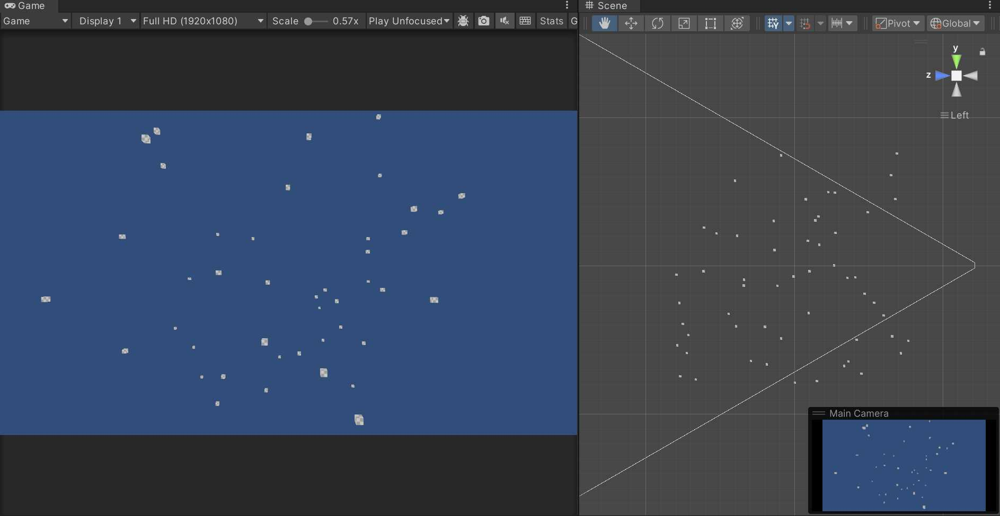

# Rendering in Unity Part 3: Submitting draws

We've unshackled our shader from Unity's own help in the last part, and (hopefully) learned a great deal. Lets continue this trend of DIY rendering! In this part we will get rid of Unity's own MeshRenderers, and rather submit draws ourself. 

Lets jazz up our scene, only a single cube is not so interesting. With some fancy [numeric field expressions](https://docs.unity3d.com/2022.2/Documentation/Manual/EditingValueProperties.html) we can easily create a randomly scattered scene full of cubes, setting our transform values to : `R(-50,50)`

The scene can be found [here](https://github.com/TJHeuvel/UnityRenderingTutorial/tree/part-three). 

## How Unity wants us to do it

Normal people would use the [RenderMesh](https://docs.unity3d.com/ScriptReference/Graphics.RenderMesh.html) API, that allows you to pass a matrix for its object to world, and let Unity handle that. This is how you'd do this in your project. Note the Graphics class now contains a bunch of DrawX and also RenderX methods, the Render ones have recently been added and its recommended to use these. 

We're not normal, we would rather provide our own. For good reason, there is no API exposed that really suits our strange needs, but we can get close enough with [RenderMeshPrimitives](https://docs.unity3d.com/ScriptReference/Graphics.RenderMeshPrimitives.html). We can provide some general parameters and a mesh, thats all we're interested in. For now we'll ignore submesh and instanceCount.

## Setup

We'd still like to use Unity as an authoring tool, so lets make our own Render System and disable the meshrenderers. Rather than have a RenderSystem component on each cube, lets make sure there is just a single one on the Camera. 



    struct DrawCall
    {
        public Mesh Mesh;
        public Material Material;
        public float4x4 ObjectToWorld;
    }

    private List<DrawCall> drawCalls;
    void OnEnable()
    {
        drawCalls = new List<DrawCall>();
        foreach (var meshRenderer in FindObjectsOfType<MeshRenderer>())
        {
            drawCalls.Add(new DrawCall()
            {
                Mesh = meshRenderer.GetComponent<MeshFilter>().sharedMesh,
                Material = meshRenderer.sharedMaterial,

                ObjectToWorld = meshRenderer.transform.localToWorldMatrix
            });
            meshRenderer.forceRenderingOff = true;//We'll do our own!
        }
    }


Observe we turn off Unity rendering with `forceRenderingOff`, however we could have also destroyed the entire GameObject. Keeping them around allows us to easily switch between normal and our custom rendering by disabling the component. In your game, if you have a massive amount of objects, you might actually gain a bunch of performance removing gameObjects. This is the reason why terrain detail does not create gameobjects, having this much extra data for each blade of grass would be wildly inefficient.  

And now for actually queueing up the draw call itself:


void LateUpdate()
{
	Shader.SetGlobalMatrix("custom_ViewMatrix", Camera.main.worldToCameraMatrix);
    Shader.SetGlobalMatrix("custom_ProjectionMatrix", GL.GetGPUProjectionMatrix(Camera.main.projectionMatrix, true));

    foreach (var draw in drawCalls)
    {
        MaterialPropertyBlock matProps = new MaterialPropertyBlock();
        matProps.SetMatrix("custom_ObjectToWorld", transform.localToWorldMatrix);

        Graphics.RenderMeshPrimitives(new RenderParams(draw.Material)
        {
            matProps = matProps
        }, draw.Mesh, 0);
    }
}
 
Notice the manual mentioning queue, this method does not 'immediately' submit a draw. It just adds it to Unitys internal structure, which will then emit a DrawIndexed at the right time. That is; when we're deferred, shadow etc. This is all still handled within Unity.

With our graphics debugger we can observe that our drawing is practically the same as before; our game view also looks exactly the same. Only when we move around the original gameobject and dont see our game update do we notice any difference.

### Fixing scene view

Our scene view is all sorts of messed up. This is because we only send the camera properties of the main camera, so its rendering the scene view from the perspective of the main camera, and thats pretty bad.

Lets use the `RenderPipelineManager.beginCameraRendering` callback to set the properties for the currently drawing camera instead. [Our code](https://github.com/TJHeuvel/UnityRenderingTutorial/commit/4847edcf1166f310f4259dd28ebc2137b07d7045) will now run once for each camera thats rendering, and our scene view looks good again! 

## Culling

Right now we are always submitting every cube to be drawn. The GPU will then reject cubes out of our view, in clip space. However this is rather wasteful, we can do a first pass to cull away what wont be visible anyway. Lets cull everything that is outside our view frustum.

We'll first need to define be able to describe our frustum planes, and then determine if our renderers are inside or out. 

What we'll do, is define our frustum as 6 [planes](https://docs.unity3d.com/ScriptReference/Plane.html), left, right, down, up, near and far. When our object is outside of any one of them, it is not visible. Unity has [builtin utilities](https://docs.unity3d.com/ScriptReference/GeometryUtility.html) for this, but of course we will reject these and subsistute our own. 

### Calculating frustrum planes

Our frustum is defined by the camera's field of view, when this is set to 60 we can see -30 degrees to 30 degrees vertically. Horizontally this is affected by the aspect ratio, our output image is narrower we also cannot see as wide. We can observe this when we resize our game view, the camera gizmo also draws a different frustum.

<video autoplay="true" controls="true" height="400px">
	<source src="https://dl.dropboxusercontent.com/s/2u8m0zo4togtfbf/Unity_TK3VcFKFjp.mp4" />
</video> 

With some trig we can calculate the exact location and size of the near and far clip:


    float2 planeSize;
    planeSize.y = math.tan(camera.fieldOfView / 2 * Mathf.Deg2Rad);
    planeSize.x = planeSize.y * camera.aspect;

    float3 nearClipMax = new float3(planeSize * camera.nearClipPlane, camera.nearClipPlane);
    float3 nearClipMin = -nearClipMax;
    float3 farClipMax = new float3(planeSize * camera.farClipPlane, camera.farClipPlane);
    float3 farClipMin = -nearClipMax; 

    Plane[] planes = new Plane[7];

    planes[0] = asdf;

    //etc


**TODO TIJMEN YOU BIG FAT LIER THIS DOESNT WORK**

These give the top right corner of our near and far plane, the bottom left are the negation of this. We can create a plane with 3 of them.

There's a faster way of calculating these, by extracting them from the projection matrix. This is described [here](http://www.cs.otago.ac.nz/postgrads/alexis/planeExtraction.pdf), and is what Unity does internally. 

### Visibility testing

Now we have our plane, lets see how we can know if our object lies within it. There are a few different ways to do this; whats presented here is a slightly inaccurate but quite fast solution.


bool IsObjectWithinFrustum(Plane[] frustumPlanes, Bounds worldBounds)
{
	foreach(var plane in frustumPlanes)
	{
        // Calculate the signed distance between the plane and the objects center
        float distance = plane.GetDistanceToPoint(bounds.center);

        // Calculate the radius of the objects size projected onto the plane
        float radius = Vector3.Dot(plane.normal, bounds.extents);

        // If the distance is greater than the radius, the box is outside the plane
        if (distance < -radius)
        {
        	return false;
        }
    }
}


Whats going on here? Whats that dot? We might be familiar with its use in comparing angles, but how does this make sense? A full explanation on the dot product can be found [here](https://gamemath.com/book/vectors.html#dot_product), but lets rush through.

The dot product can be used to project one vector on another. In a racing game, we might want to show the players speed in our UI. If we were to visualise the length or magnitude of our velocity vector, our homemade speedometer would increase when the players car is pushed sideways. If the players vehicle would somehow fall vertically from the sky the needle of our speedometer would go nuts. 
We can argue that we are not interested in *all* velocity, rather only the *forward* velocity. To get this we project the velocity upon the cars forward vector, i.e. dot(forward, velocity).

Back in our culling, we want to know how large the object is, in the direction of our plane's normal. How thick is the object if we'd go through it from this direction?

<video autoplay="true" controls="true" height="400px">
	<source src="https://dl.dropboxusercontent.com/s/rjoqjympgylgbbq/Unity_EWGXsBevud.mp4">
</video>

The blue arrow represents our plane normal, the green arrow is the result of the dot product. The gray wireframe is the aabb of our object, we can observe that indeed our maths provide us with the size of the bounds, in the direction we are interested in. 

Lets integrate this into our renderer:

Plane[] planes;
void LateUpdate()
{
	calculatePlanes(planes);

	foreach(var draw in drawCalls)
	{
		if(!IsObjectWithinFrustum(planes, draw[i].WorldBounds)) continue;
		
		var propBlock = new MaterialPropertyBlock();
		propBlock.SetMatrix("Custom_ObjectToWorld", draw.ObjectToWorld);

		Graphics.RenderMeshPrimitives(new RenderParams(draw.Material) 
		{
			matProps = propBlock; 
		}, draw.Mesh, 0, 1);
	}
}


Now when we move around, we can observe fewer draw calls. Interestingly our scene view will also show us our effect!